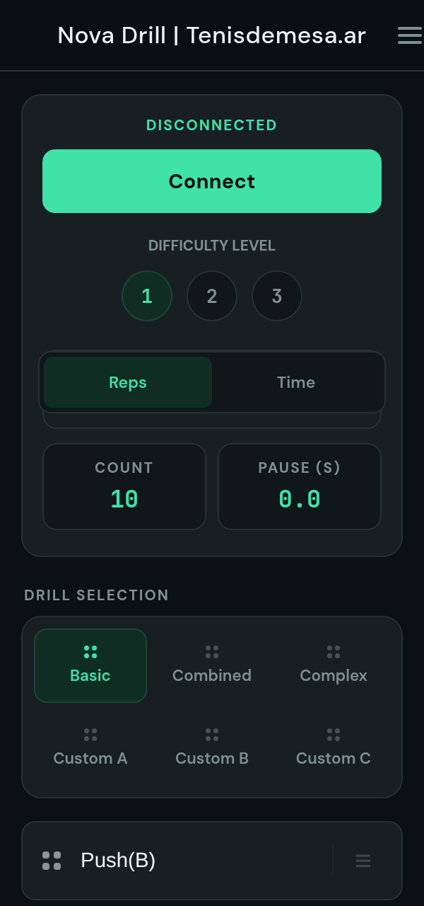
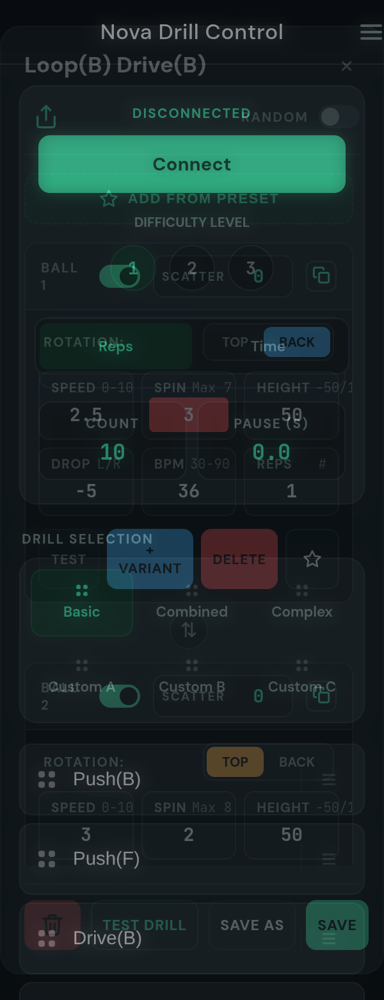
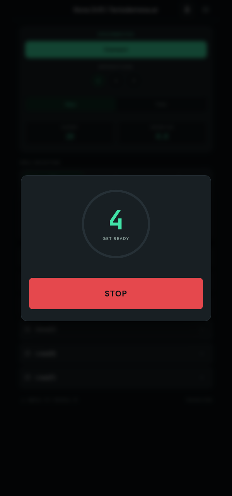

# Nova S Pro Drill Control

A pretty web client for the Nova S Pro table tennis robot. 
This tool can be used as a replacement for the original app, removing the requirements for server connectivity and user login.

An independent, actively developed continuation of the original
[**olanga/nova**](https://github.com/olanga/nova). See
[Credits](#credits) and [What this fork adds](#what-this-fork-adds).

| Main | Editor | Countdown |
| :---: | :---: | :---: |
|  |  |  |

## Usage

**Online/Offline:**

  * Visit: <https://ceneka.github.io/nova/> (deployed from `main` by GitHub Actions)
  * Self hosting: https is required

**Local:**

  * Download repository files and host locally (e.g., `python3 -m http.server`).

**Requirements:**

  * Chrome, Cromite or any other Chromium-based browser. iPhone is not supported as it uses Webkit browser engine.

## Install as an app

The site is a **Progressive Web App**. Open the menu → **Settings** →
**Install app**, or use your browser's own *Add to Home screen*.

Installed, it runs in its own window with no browser chrome, and **it works
with no internet connection at all** — the whole app is cached on the device
the first time you open it. That is the point at a table, where the wifi is
whatever the hall happens to have. Drills, presets and history still live in
`localStorage`, so installing changes nothing about your data.

A new version is picked up automatically on the next launch. Settings also
shows whether the offline copy is ready yet.

## Features

**General**

  * **Fully customizable drills** Add and remove drills and balls. Share, export and import settings.
  * **Data Persistence:** Settings and drills saved to browser local storage.
  * **Themes:** 4 options, including dark mode.
  * **Settings screen:** themes, the preset library, training history, drill defaults and data resets live in one place, behind the menu.
  * **Statistics:** a stored history of every session you have trained, with totals, a 14-day chart, your most-played drills, and per-session delete.
  * **Installable:** add it to the home screen and it opens like a normal app — no browser, and no signal needed.


**Drill Management**

  * **Edit & Create:** Modify pre-programmed drills or create custom ones (Groups A, B, C).
  * **Sharing:** Import/export via CSV or share online specific drills using codes.
  * **Randomization:** Randomize ball sequences or configure multiple variants of a single ball.
  * **Scatter:** Randomize drop point (DP) of a single ball. Configured DP +/- scatter value.
  * **Drag-and-Drop Management:** Easily reorder drill sequences or move drills between categories using drag-and-drop.
  * **Controls:** Set drill duration (time or repetitions), pause/stop, and countdown timers.
  * **Tap to skip:** Starting countdown timer can be skipped by tapping on it.<br>


**Editor Tools**

  * **Drill Editor:** Long-press drill button to access. Supports deletion, "save as", and testing entire sequences.
  * **Ball Editor:** Add/remove balls, adjust sequence, rename drills, and test single balls without saving.
  * **Ball Presets:** Library of named ball recipes ("Short under serve", "Fast drive", …). Add one into any drill with its placement and depth variations expanded, or save a ball you have tuned by hand as a new preset.


## Ball Presets

A preset is a named ball recipe plus up to two variation axes:

  * **Placement** (the Drop value) — where the ball goes sideways. Labelled from the receiver's point of view for a right-handed receiver, so backhand is a negative drop and forehand positive. The default set is **BH / Center / FH** at drop -5 / 0 / +5.
  * **Depth** (the Height value) — how far the ball carries. The default set is **Short / Mid / Long**.

Both axes are optional and fully editable: rename the labels, change the
values, add or remove rows, or leave one axis empty to pin that value.

The top of the drill editor has an "Add from preset" button, repeated at the
bottom of the list where you add balls. Each preset offers three ways in:

| Action | Result |
| --- | --- |
| **+ Ball** | One ball, exactly as configured in the preset. |
| **Variants** | One step holding every placement × depth combination. The robot picks one at random on each repetition. |
| **Sequence** | One step per combination, in order (Short→BH, Short→Center, Short→FH, Mid→BH, …). |

So "Short under serve" with the default axes becomes a 3 × 3 = 9 ball set, and
you can train the same serve to backhand, centre and forehand without touching
a single number.

A starter library of 8 serve and rally presets ships with the app; edit, rename
or delete any of them. Presets can be exported and imported as their own JSON
or CSV file (Settings → Presets) so a library can move between devices. This is
separate from the drill CSV below, which is unchanged and still shared with
other apps.

Presets are stored per browser in `localStorage`, and are not affected by
"Factory Reset" of drills alone.

## Custom Drills (CSV)

Drills can be imported via CSV. Each category (A, B, C) holds 100 drills; each drill holds 20 balls. Variant balls (pseudo-randomness) share the same ball number.

**CSV Format:** `Set;Ball;Name;Speed;Spin;Type;Height;Drop;BPM;Reps`

**Example:**

```csv
A;1;Drill A2;7.5;5;top;50;-5;60;1
A;2;Drill A2;7.5;5;back;50;-5;30;1
B;1;Drill B1;7.5;5;top;50;-5;60;1
B;1;Drill B1;7.5;5;back;50;5;60;1
```

## Technical Parameters

| Parameter | Description | Range | Step |
| :--- | :--- | :--- | :--- |
| **Spin type** |top/back | - | - |
| **Speed** | ball speed | 0 - 10 | 0.5 |
| **Spin** | ball spin | 0 - 10 | 0.5 |
| **Height** | Ball height | -50 (down) to 100 (up) | 1 |
| **Drop** | Drop point | -10 (right) to 10 (left) | 0.5 |
| **bpm** | balls/minute | 30 - 90 | 1 |
| **Reps** | Repetitions | 1 - 200 | 1 |


## What this fork adds

Work done here on top of the original, most of it driven by things the
upstream app could not do or did not get right:

  * **Ball presets** — a library of named ball recipes dropped into any drill with placement and depth variations expanded, in their own JSON/CSV format so they cannot break the shared drill CSV.
  * **Settings as a full screen** — themes, presets, statistics and data resets moved out of the hamburger menu, which now carries only drill actions.
  * **Training history** — sessions logged per robot connection, with totals, a 14-day chart, a most-played ranking, and the ability to delete a single session or all of them.
  * **Fixes** — connecting silently doing nothing, the 20-drill category cap, the Settings back button, preset field overflow, and three identical-looking preset entry points in the editor.
  * **Installable PWA** — a web manifest, a service worker and a real icon set, so the app installs to the home screen and opens offline.
  * **Continuous deployment** — pushing to `main` runs the test suites and publishes to GitHub Pages. There is still no build step.

The drill CSV format, the ball array and the Bluetooth packet format are
unchanged, so drills remain interchangeable with the original app.

## Credits

This project is an independent continuation of the original
[**olanga/nova**](https://github.com/olanga/nova) and is not affiliated with or
endorsed by its author. The drill CSV format documented above is theirs, and
is deliberately kept compatible.

Upstream documentation that still applies:

  * [Wiki — general information](https://github.com/olanga/nova/wiki/General-information)
  * [Wiki — Spinsight measurements with Nova S Pro](https://github.com/olanga/nova/wiki/Spinsight-measurements-with-Nova-S-Pro)

Spinsight measurements are based on findings by
[smee](https://github.com/smee/nova-s-custom-drills) and plunder.

## Development

No build step — it is plain ES modules. Serve the folder over HTTP:

```bash
python3 -m http.server 8123
```

```bash
node --test tests/presets.test.mjs        # unit tests
```

The PWA icons are committed like every other asset. `icons/*.svg` are the
sources; regenerate the PNGs with `tools/make-icons.sh` after editing one
(needs ImageMagick). `sw.js` is also hand-written, not generated — when you
add or remove a file the app loads, update its `PRECACHE` list. The integration
suite fails if you forget.

Pushing to `main` runs both suites and, if they pass, publishes to GitHub
Pages (`.github/workflows/pages.yml`). Nothing to build — the app is served
as-is.

Browser integration checks: open `tests/integration.html` (the page title
turns into `PASS(n)` / `FAIL(n)`). See [AGENTS.md](AGENTS.md) for the
architecture, the ball-array layout and the conventions to follow.


